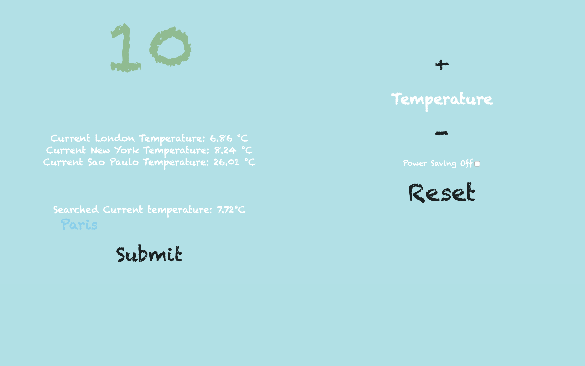

# Thermostat

Week 5 Afternoon Challenge

---

## How to Run

Clone this repo, in the command line navigate to the [_jasmine_](jasmine) directory and in the command line type:

```
bundle install
```

Once the dependencies are installed, right click on the [_index_](index.html) file, click `copy path` and paste this into the Google Chrome browser.

### Running Tests

From the [_jasmine_](jasmine) directory, right click on the [_SpecRunner_](SpecRunner.html) file, click `copy path` and paste this into the Google Chrome browser.

This will display the `Jasmine Test Suite` showing 10 passing tests.

---

#### Starting Temperature


#### Power Saving Mode Off - Max Temperature


#### Minimum Temperature


#### Seach for Another Cities Weather


